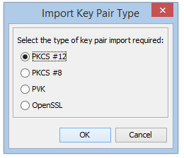

## PURPOSE

The intent of this project is to:
1. Make it easy to verify the connection to [KOMBIT Serviceplatformen](https://www.serviceplatformen.dk) using either of its supported security models.
2. Serve as an example on how to implement and configure a client to KOMBIT Serviceplatformen for each of its supported
   security models.

## TARGET AUDIENCE

This file is targeted at Java developers who implement integrations to Serviceplatformen.

## INSTRUCTIONS

### PREREQUISITES

 * Java Development Kit 8 installed.
 * Apache Maven 3.2.5 or higher is installed.
 
The client is fully configured and should work as is. The client is tested with Java 8.

### EXECUTION

1. Run the client by executing `run.bat` or `run.sh`
2. Follow the instructions written in the console.

### BUILD

The following information should be sufficient in order to compile and run the source code, independently of the choice of IDE:

1. To build application, execute: `mvn clean install`
2. To run the application from command line, execute: `mvn spring-boot:run`

### SETUP INFORMATION

* Password for current keystore `wRFsRP63H3kNEhDU`

### CHANGE SERVICE AGREEMENT

It may be desirable for a new Serviceplatformen user system to verify that a connection is possible using their own service agreement and certificate.
To replace the dedicated DemoService certificate with a different one, follow the instructions below which use [Keystore Explorer](http://keystore-explorer.org/). 

1. Open `src/main/resources/client.jks` for the relevant client with KeyStore Explorer.
2. Remove the existing public-private key pair.
3. Import your own key pair.
    1. Tools ➞ Import Key Pair
    
        
        
    2. Choose the key type you are importing.
    
        
        
    3. Set a password and make sure the password for the key pair is the same as the password for the entire Java KeyStore file.
    
        
        
    4. If you have changed the client.jks password or certificate alias, update these files accordingly:
        * In cxf.xml for both client types: 
            ```
            <http:conduit name="{http://serviceplatformen.dk/xml/wsdl/soap11/SP/Demo/1/}DemoPort.http-conduit">
                <http:tlsClientParameters>
                    <sec:keyManagers keyPassword="**REPLACE_PASSWORD**">
                        <sec:keyStore type="JKS" password="**REPLACE_PASSWORD**" resource="client.jks"/>
                    </sec:keyManagers>
                    <sec:trustManagers>
                        <sec:keyStore type="JKS" password="Test1234" resource="trust.jks"/>
                    </sec:trustManagers>
                </http:tlsClientParameters>
                <http:client AutoRedirect="true" Connection="Keep-Alive"/>
            </http:conduit>
            ```
        * In client.properties for token client only:
            ```
            org.apache.ws.security.crypto.merlin.keystore.password=**REPLACE_PASSWORD**
            org.apache.ws.security.crypto.merlin.keystore.alias=**REPLACE_KEY_ALIAS/NAME**
            ```    

To change the service agreement used, adapt the following files:

* For calling with InvocationContext, update `invocationcontext.properties` to match the UUIDs reported by the
  Serviceplatformen administration module:
  ```
  service.agreement.uuid=17a44431-526a-416c-bb66-bd262049e751
  user.system.uuid=50be05bb-f31a-4673-9a93-d740e7397b16
  service.uuid=d8a062c0-27d1-11e6-b67b-9e71128cae77
  user.uuid=97782c1e-ec6a-4fcf-9c6c-cb030948d1d5
  ```
* For calling with AuthorityContext, update `authoritycontext.properties` to match the CVR number of the authority
  that approved the service agreement:
  ```
  municipality.cvr=29189846
  ```
* For calling with KOMBIT Token, update `token.properties` to match the CVR number of the authority
  that approved the service agreement:
  ```
  municipality.cvr=29189846
  ```

## CONTENT
* `readme.md`: This file.
* `run.sh`/`run.bat`: Runs the Java application.
* `/demoservice-context-client`: Contains the source code, contracts and resources of the InvocationContext and AuthorityContext client.
* `/demoservice-token-client`: Contains the source code, contracts and resources of the KOMBIT Token client.
- `image/*`: Images used by this readme.